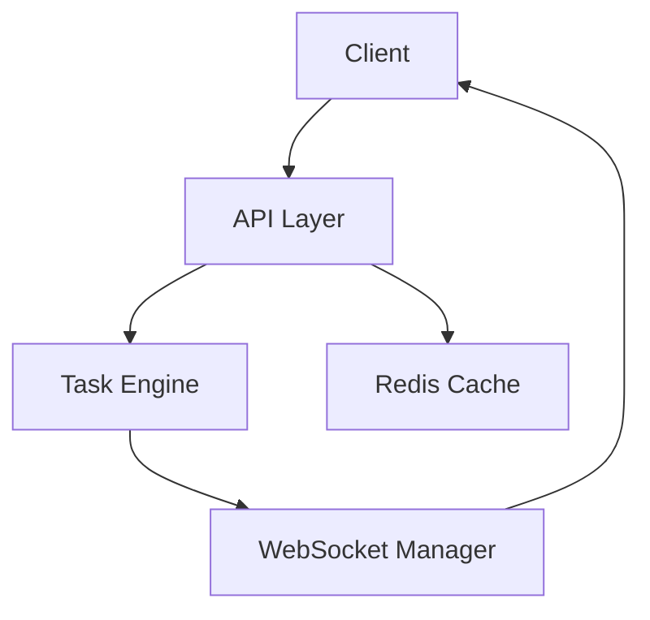
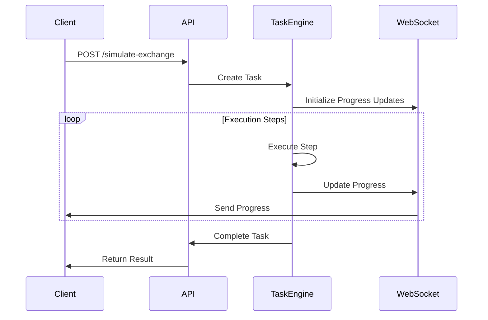

# KURR Exchange - System Design Document

## 1. System Overview

KURR Exchange is a Node.js/TypeScript-based API that simulates currency exchange operations with real-time progress tracking. The system provides a robust platform for simulating currency exchanges with multiple processing stages and live updates through WebSocket connections.


### 1.1 Key Features

- Currency exchange simulation with multi-stage processing
- Real-time progress tracking via WebSocket
- Redis-based caching system
- Task retry mechanism with configurable parameters
- Rate limiting and security middleware
- Comprehensive error handling
- Docker containerization support

## 2. Architecture

### 2.1 High-Level Architecture



### 2.2 Core Components

1. **API Layer**
   - Express.js-based REST API
   - Handles incoming requests and response formatting
   - Implements rate limiting and security middleware

2. **Task Engine**
   - Manages task lifecycle and execution
   - Implements retry mechanism
   - Handles parallel and sequential task execution

3. **WebSocket Manager**
   - Manages real-time connections
   - Handles task progress updates

4. **Redis Cache**
   - Implements caching for completed exchanges
   - Singleton pattern implementation

## 3. Data Flow

### 3.1 Exchange Simulation Flow

1. Client submits exchange request
2. System checks Redis cache for existing results
3. If not cached:
   - Creates new task
   - Executes simulation steps
   - Updates progress via WebSocket
   - Caches result upon completion
4. Returns task ID or cached result

### 3.2 Task Execution Steps



## 4. Security

### 4.1 Implementation Details

- Helmet.js for HTTP security headers
- Rate limiting (100 requests per 15 minutes)
- Input validation
- Error handling middleware

## 5. Performance Optimization

### 5.1 Caching Strategy

- Redis caching for completed exchanges
- Configurable TTL (24 hours default)
- Cache key format: `exchange:{baseCurrency}:{targetCurrency}:{amount}`

### 5.2 Task Processing

- Configurable retry mechanism
- Parallel execution support
- Progress tracking optimization

## 6. Scalability

### 6.1 Current Implementation

- Containerized application
- Redis for distributed caching
- Stateless API design

### 6.2 Future Considerations

- Horizontal scaling capability
- Load balancer integration
- Message queue implementation for task distribution

## 7. Monitoring and Logging

### 7.1 Implemented Features

- Pino logger integration
- Health check endpoint
- Metrics endpoint for basic monitoring
- WebSocket connection logging

## 8. Development and Deployment

### 8.1 Development Environment

- TypeScript configuration
- ESLint and Prettier integration
- Jest testing framework
- Docker development environment

### 8.2 Deployment

- Docker containerization
- Environment variable configuration
- Redis dependency management

## 9. Testing Strategy

### 9.1 Implementation

- Jest for unit and integration tests
- Test containers for Redis testing
- Coverage requirements (80% minimum)
- Comprehensive task simulation testing

## 10. API Documentation

### 10.1 Endpoints

#### POST /simulate-exchange
- Purpose: Initiate a new exchange simulation
- Body Parameters:
  - baseCurrency: string
  - targetCurrency: string
  - amount: number
- Returns: Task ID or cached result

#### GET /simulate-exchange/:taskId
- Purpose: Get status of specific exchange task
- Returns: Task status, progress, and result if completed

#### GET /simulate-exchange
- Purpose: List all exchange tasks
- Returns: Array of task statuses

### 10.2 WebSocket Events

#### Subscribe to Task Updates
```json
{
  "type": "subscribe",
  "taskId": "uuid"
}
```

#### Task Update Message
```json
{
  "taskId": "uuid",
  "status": "in_progress|completed|failed",
  "progress": 0.75,
  "result": {
    "conversionRate": 1.2,
    "exchangeAmount": 120
  }
}
```

## 11. Error Handling

### 11.1 Error Types

- ValidationError: Invalid input parameters
- TaskServiceError: General task service errors
- SimulationError:  Simulation processing errors

### 11.2 Error Response Format

```json
{
  "code": "ERROR_CODE",
  "message": "Error message"
}
```

## 12. Configuration

### 12.1 Environment Variables

- `PORT`: Server port (default: 3000)
- `REDIS_HOST`: Redis host
- `REDIS_PORT`: Redis port
- `REDIS_ENABLED`: Enable/disable Redis caching

## 13. Maintenance and Support

### 13.1 Monitoring

- Health check endpoint: `/health`
- Metrics endpoint: `/metrics`
- WebSocket connection logs
- Redis connection status

### 13.2 Debugging

- Detailed error logging
- Task execution tracking
- WebSocket message logging

## 14. Future Enhancements

1. **Performance Improvements**
   - Implement connection pooling
   - Add request queuing
   - Optimize cache strategies

2. **Feature Additions**
   - Support for more currency pairs
   - Historical exchange rate tracking
   - User authentication and rate limiting
   - Advanced simulation parameters to make it more realistic and dynamic

3. **Infrastructure**
   - Kubernetes deployment support
   - Multi-region support
   - Advanced monitoring and alerting
   - Automated scaling policies

## 15. Conclusion

KURR Exchange provides a robust and scalable solution for currency exchange simulation with real-time updates. The architecture ensures high availability, maintainability, and extensibility while following best practices for modern web applications.

